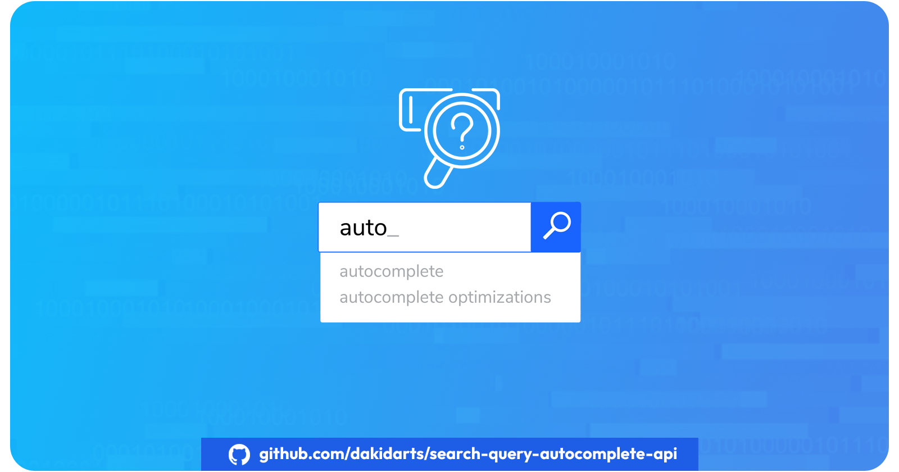

# Search Query Autocomplete API



## ✨ API Overview

The Search Query Autocomplete API provides autocomplete suggestions from popular search engines like Google, Bing, DuckDuckGo, and YouTube, enhancing the search experience in your application.

## 🚀 Features

- Multi-engine support: Choose from four major search engines to tailor autocomplete suggestions to your users' preferences.
  - Google Autocomplete
  - Bing Autocomplete
  - DuckDuckGo Autocomplete
  - YouTube Autocomplete
- Simple integration: Easy-to-use endpoints supporting both GET and POST requests for seamless integration into your application.
- Error handling: Comprehensive error handling ensures smooth operation, with detailed error messages provided for troubleshooting and debugging.
- Flexible usage: Whether you're building an e-commerce platform, content discovery app, or productivity tool, the Search Query Autocomplete API has you covered.

### ⚡️ New Features

#### /ddgs/search
- Web Search: Perform searches across the web efficiently.
- Related Results: Get relevant titles, URLs, and summaries for your queries.
- Safe Search: Filter results with varying levels of content safety.
- Customizable: Specify search parameters like region and time limits for tailored results.

#### /ddgs/proxy/search
- Proxy Search: Conduct searches through a specified proxy server.
- Secure Searches: Maintain anonymity with proxy configurations.
- Enhanced Privacy: Proxy details managed securely for each search.
- Flexible Queries: Supports both GET and POST methods for versatile usage.

#### /ddgs/blaze/search
- Customizable Parameters: Customize search parameters such as keywords, region, SafeSearch mode, time limit, backend, and maximum results.
- Error Handling: Detailed error responses for missing or invalid parameters.

#### /ddgs/ai
- AI Chat: Engage in AI-driven conversations with multiple models (e.g., GPT-3.5, Claude-3-Haiku, LLaMA-3-70b, Mixtral-8x7b).
- Parameter Flexibility: Support for input keywords and selection of AI models.
- Error Handling: Handle errors for missing parameters and invalid model selections.

#### /ddgs/images
- Image Search: Search for images with extensive filtering options.
- Advanced Filters: Filters include region, SafeSearch mode, time limit, image size, color, type, layout, license, and maximum results.
- Validation and Error Handling: Validate input parameters and provide clear error messages for invalid inputs.

#### /ddgs/videos
- Video Search: Search for videos with filters based on resolution, duration, licensing, and other criteria.
- Filtering Options: Parameters include keywords, region, SafeSearch mode, time limit, resolution, duration, license type, and maximum results.
- Error Management: Manage errors related to parameter validation and unexpected server issues.

#### /ddgs/news
- News Search: Search for news articles with options for keywords, region, SafeSearch mode, time limit, and maximum results.
- Parameterized Search: Parameters include keywords, region, SafeSearch mode, time limit, and maximum results.
- Exception Handling: Handle exceptions gracefully with detailed error messages for enhanced user experience.

#### /ddgs/maps
- Map Search: Retrieve map-based search results efficiently.
- Location Specific: Search with keywords and optional location parameters (place, street, city, etc.).
- Radius Control: Expand search radius by kilometers to refine results.
- Maximum Results: Limit search output with specified maximum results.
- Error Handling: Returns clear error messages for missing parameters or server issues.

#### /ddgs/translate
- Translation Service: Translate keywords from one language to another.
- Language Support: Automatically detects source language if not specified.
- Customizable Translation: Specify target language (default: English).
- Versatile Usage: Supports both GET and POST methods for query flexibility.
- Error Management: Handles unexpected errors with informative messages.

## 🏁 Getting Started

1. **Sign Up**: Register for an API key on our [RapidAPI listing](https://rapidapi.com/kidddevs/api/search-query-autocomplete-api) to gain access to the Search Query Autocomplete API.
2. **Integrate**: Follow the step-by-step instructions to integrate the API into your application and enhance your search experience.

## ⚡️ Usage Examples

### Google:

```bash
curl --request GET \
	--url 'https://search-query-autocomplete-api.p.rapidapi.com/google?query=how%20to' \
	--header 'X-RapidAPI-Host: search-query-autocomplete-api.p.rapidapi.com' \
	--header 'X-RapidAPI-Key: SIGN-UP-FOR-KEY'
```	

### Bing:

```bash
curl --request GET \
	--url 'https://search-query-autocomplete-api.p.rapidapi.com/bing?query=how%20to' \
	--header 'X-RapidAPI-Host: search-query-autocomplete-api.p.rapidapi.com' \
	--header 'X-RapidAPI-Key: SIGN-UP-FOR-KEY'
```

### DuckDuckGo:

```bash
curl --request GET \
	--url 'https://search-query-autocomplete-api.p.rapidapi.com/duckduckgo?query=how%20to' \
	--header 'X-RapidAPI-Host: search-query-autocomplete-api.p.rapidapi.com' \
	--header 'X-RapidAPI-Key: SIGN-UP-FOR-KEY'
```

### YouTube:

```bash
curl --request GET \
	--url 'https://search-query-autocomplete-api.p.rapidapi.com/youtube?query=how%20to' \
	--header 'X-RapidAPI-Host: search-query-autocomplete-api.p.rapidapi.com' \
	--header 'X-RapidAPI-Key: SIGN-UP-FOR-KEY'
```	

## 🔨 Issues

If you encounter any issues or have feature requests, please feel free to [open an issue](https://github.com/dakidarts/search-query-autocomplete-api/issues) on GitHub.

## ⚖️ License

This project is licensed under the [MIT License](https://github.com/dakidarts/search-query-autocomplete-api?tab=MIT-1-ov-file#).

## 🌍 Follow Us

- Website: [dakidarts.com](https://dakidarts.com)
- Twitter: [@dakidarts](https://twitter.com/dakidarts)
- Instagram: [@dakidarts](https://instagram.com/dakidarts)
- LinkedIn: [dakidarts](https://linkedin.com/company/dakidarts)
